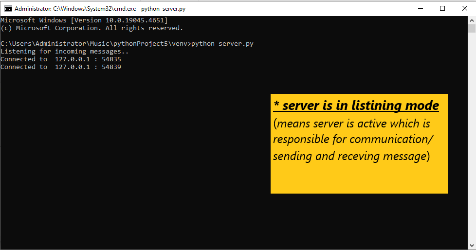
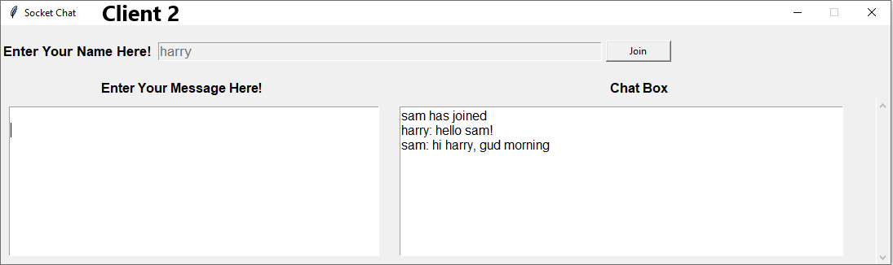

# GUI Chat Application

This project involves the development of a GUI-based chat application using Python, leveraging the **Tkinter** library for the user interface and **Socket** programming for the client-_server_ communication.

## Overview

The application is built on a client-_server_ architecture, where multiple clients can connect to a _server_, and all messages are broadcasted to all connected users in real-time. The GUI is designed using **Tkinter**, providing an intuitive and interactive chat room interface for users.

## Technologies Used

- **Python**
- **Tkinter**: For the graphical user interface
- **Socket**: For handling client-_server_ communication

## Features

- **Real-time messaging** between multiple clients.
- **Simple and easy-to-use interface**.
- **Efficient handling** of multiple client connections by the _server_.

## How to Run

1. **Clone the repository**. 
2. **Run the _server_** using `python server.py`. 
3. **Run the client** using `python client.py`. 
4. **Connect multiple clients** to the _server_ and start chatting!

### Important Note

In the `client.py` file, the number of clients is **restricted to a maximum of 5**. You can change this limit as per your requirements by modifying the code.

## Screenshots

Below are some screenshots of the application:

1. **Server Console**:

    🖥️

2. **Client Interface**:

    💬

3. **Client Interface 2 **:

    🖼️

---

### Connect with Me

- **LinkedIn**: [Sunil R](your-linkedin-profile-url)
- **Email**: sunilr31r@gmail.com
